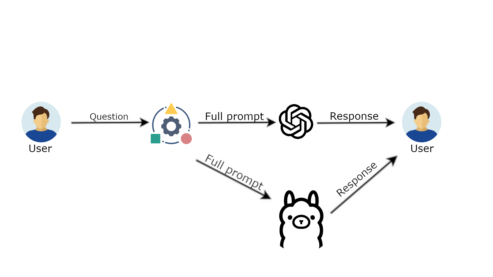
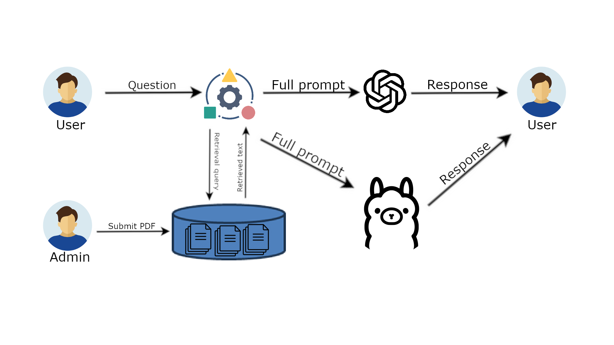
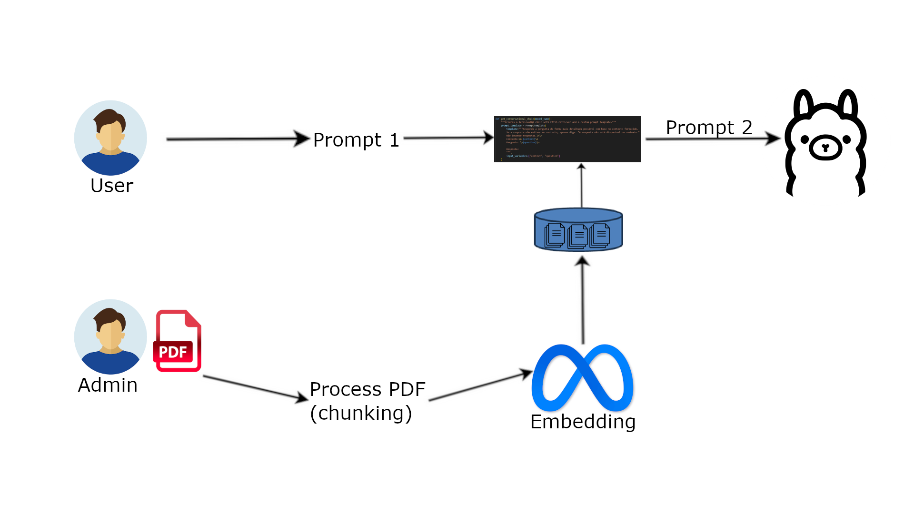
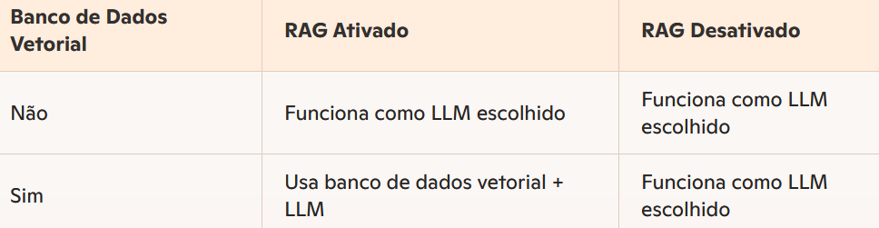

# RAG Chatbot

An intelligent chatbot developed for a project in Instituto Politécnico de Viana do Castelo (IPVC) that uses **Retrieval-Augmented Generation (RAG)** to process and answer questions based on PDF documents.

## Table of Contents

- [Features](#-features)
- [Technologies Used](#-technologies-used)
- [System Architecture](#-system-architecture)
- [Installation](#-installation)
- [Configuration](#-configuration)
- [How to Use](#-how-to-use)
- [Project Structure](#-project-structure)
- [API Endpoints](#-api-endpoints)
- [Contributing](#-contributing)
- [License](#-license)

## Features

- 🔍 **PDF Processing**: Upload and automatic processing of PDF documents
- 🧠 **RAG (Retrieval-Augmented Generation)**: Accurate responses based on PDF content
- 🤖 **Multiple Models**: Support for OpenAI GPT and Ollama (local LLM)
- 📊 **Intuitive Interface**: Modern web interface with Bootstrap
- 🔗 **Source Citations**: Shows page and file sources of responses
- 📱 **Responsive**: Works on desktop and mobile devices
- ⚡ **Real-time Processing**: Fast and efficient responses

## Technologies Used

### Backend
- **Python 3.8+**
- **Flask** - Web framework
- **LangChain** - Framework for LLM applications
- **FAISS** - Vector search library
- **PyPDF2** - PDF processing

### AI Models
- **OpenAI GPT** - OpenAI language model
- **Ollama** - Local LLM for privacy

### Frontend
- **HTML5/CSS3**
- **Bootstrap 5** - CSS framework
- **JavaScript** - Interactivity

### Storage
- **FAISS Index** - Vector indices for semantic search
- **Pickle** - Data serialization

## System Architecture

The system follows a modular architecture with the following main components:

```
┌─────────────────┐    ┌──────────────────┐    ┌─────────────────┐
│   Frontend      │    │    Backend       │    │   AI Models     │
│   (Flask UI)    │◄──►│   (Flask API)    │◄──►│  (OpenAI/Ollama)│
└─────────────────┘    └──────────────────┘    └─────────────────┘
                              │
                              ▼
                       ┌──────────────────┐
                       │  Vector Store    │
                       │   (FAISS)        │
                       └──────────────────┘
```

### Data Flow

1. **PDF Upload** → Text extraction → Chunking
2. **Embedding** → Vector creation → FAISS storage
3. **User question** → Question embedding → Semantic search
4. **Relevant context** → Answer generation → Return to user

## Installation

### Prerequisites

- Python 3.8 or higher
- pip (Python package manager)
- Git

### Installation Steps

1. **Clone the repository**
```bash
git clone https://github.com/your-username/CHATBOT_WITH_RAG.git
cd CHATBOT_WITH_RAG
```

2. **Create a virtual environment**
```bash
python -m venv venv
# Windows
venv\Scripts\activate
# Linux/Mac
source venv/bin/activate
```

3. **Install dependencies**
```bash
pip install -r requirements.txt
```

4. **Configure environment variables**
```bash
# Create a .env file in the project root
touch .env
```

## Configuration

### 1. Environment Variables

Create a `.env` file in the project root with the following variables:

```env
# OpenAI Configuration
OPENAI_API_KEY=your_openai_api_key_here

# Chunking Configuration
CHUNK_SIZE_OPENAI=10000
CHUNK_OVERLAP_OPENAI=1000
CHUNK_SIZE_OLLAMA=1200
CHUNK_OVERLAP_OLLAMA=200
```

### 2. Ollama Configuration (Optional)

If you want to use Ollama for local processing:

```bash
# Install Ollama
curl -fsSL https://ollama.ai/install.sh | sh

# Download a model (example)
ollama pull llama2
```

### 3. Directory Structure

The project will automatically create the following directories:
- `data/raw_pdfs/` - Uploaded PDFs
- `data/faiss_index_openai/` - OpenAI vector indices
- `data/faiss_index_ollama/` - Ollama vector indices
- `logs/` - Log files

## How to Use

### 1. Start the Server

```bash
python app.py
```

The server will be available at: `http://localhost:5000`

### 2. Web Interface

1. **Upload PDFs**: Use the sidebar to load PDF documents
2. **Configure RAG**: Choose the embedding model and enable RAG
3. **Process PDFs**: Click "Load RAG with PDF" to process documents
4. **Ask Questions**: Use the "Chatbot" tab to interact with the system

### 3. Main Features

#### Upload and Processing
- Support for multiple simultaneous PDFs
- Automatic text processing
- Vector index creation

#### Intelligent Chat
- Responses based on PDF content
- Source citations (file and page)
- Support for questions in Portuguese

#### PDF Visualization
- Integrated document viewing
- File downloads
- List of uploaded PDFs

## Project Structure

```
CHATBOT_WITH_RAG/
├── app.py                 # Main Flask application
├── requirements.txt       # Python dependencies
├── .env                   # Environment variables
├── .gitignore            # Git ignored files
├── README.md             # This file
│
├── config/               # Configuration
│   └── config.py
│
├── data/                 # Data and indices
│   ├── raw_pdfs/         # Uploaded PDFs
│   ├── faiss_index_openai/   # OpenAI indices
│   └── faiss_index_ollama/   # Ollama indices
│
├── models/               # AI models
│   ├── embeddings/       # Embedding models
│   ├── llms/            # Language models
│   └── retriever/       # Retrieval system
│
├── templates/            # HTML templates
│   ├── index.html
│   └── view_pdf.html
│
├── static/              # Static files
│   ├── style.css
│   └── images/          # Images and graphics
│
├── utils/               # Utilities
│   ├── pdf_processing.py
│   ├── text_processing.py
│   └── vector_store.py
│
└── tests/               # Tests
    ├── test_pdf_processing.py
    └── test_vector_store.py
```

## API Endpoints

### Upload and Processing
- `POST /upload` - Upload PDFs
- `POST /process_pdfs` - Process PDFs for RAG
- `GET /list_pdfs` - List uploaded PDFs

### Chat and Visualization
- `POST /chat` - Send message to chatbot
- `GET /view/<filename>` - View PDF
- `GET /download/<filename>` - Download PDF


## Tests

Run unit tests:

```bash
# Run all tests
pytest

# Run specific test
pytest tests/test_pdf_processing.py

# Run with coverage
pytest --cov=.
```

## System Images

The project includes diagrams that illustrate the system's operation:


*General system architecture*


*Data processing flow*


*PDF document processing*


*RAG integration with PDFs*

## Contributing

Contributions are welcome! To contribute:

1. Fork the project
2. Create a feature branch (`git checkout -b feature/AmazingFeature`)
3. Commit your changes (`git commit -m 'Add some AmazingFeature'`)
4. Push to the branch (`git push origin feature/AmazingFeature`)
5. Open a Pull Request

### Code Standards

- Use Python 3.8+
- Follow PEP 8 for code style
- Add tests for new features
- Document important functions and classes

## License

This project is under the MIT license. See the `LICENSE` file for more details.


